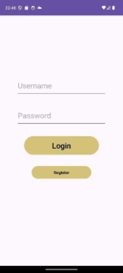
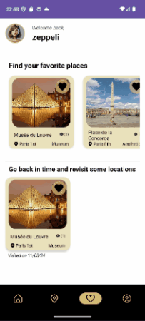
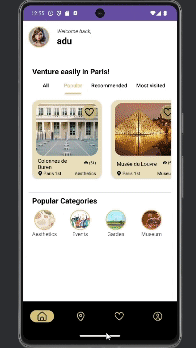
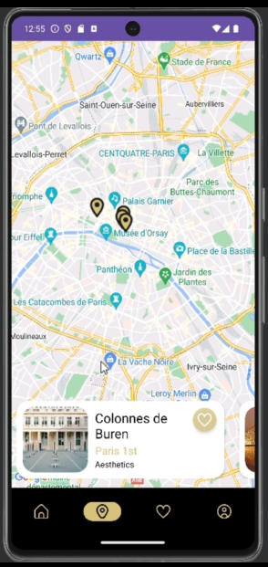

# Tourism App
Goal: In a team of 4, make an app, preferably tourism/education-themed, from scratch

## Contents
- [Overview](#overview)
- [Branches Organisation](#branches-organisation)
- [Authentification](#authentification)
- [Map](#map)
- [Database Management](#database-management)
- [Activity Details](#activity-details)
- [Conclusion](#conclusion)

## Overview
As the Paris Olympics approach, we thought it would be a good idea to make an app that lists most ***FREE*** activities accessible within Paris, to make discovering the French capital easier to tourists.

## Branches Organisation
We had many problems with the merges. You should find the branch 'Try Merging' to test almost all functionalities. Regrettably, it still has issues that are working well either in the 'master' branch or the 'Map' branch.    
On the 'master' branch you should be able to find everything working perfectly apart from the Map.    
On the 'Map' branch, the map has been implemented but with an older version of the master branch, thus with many features missing.   

### Task Distribution
|Task|Contributor|
|----|-----------|
|Authentification|Ali|
|Map|Auriane|
|Database Management|Salomé|
|Activity Details|Joyce|

### App preview
- Create or log into an account. \

- Like and unlike places. \
 
- Map of the different listed places. \


Our design was solely made on Figma, while taking inspiration from many designs on [dribbble](https://dribbble.com/), mostly the following:
- [Travel App Design by Anik Deb for Grapeslab](https://dribbble.com/shots/18741087-Travel-App-Design)
- [Loka Travel App by Ceptari Tyas for Piqo Studio](https://dribbble.com/shots/16123852-Loka-Travel-App)
- [Travel App by Listya Dwi Ariadi](https://dribbble.com/shots/15536071-Travel-App)

## Authentification
by Ali

### Tasks
- Create the Login and Register activities
- Fetch or create the user's data
- Verification of credentials before granting access
- Create the Profile fragment
- Fetch data in the Profile and modify it dynamically in the database from the app

### Login and Register activities

The Login activity is the startup activity. The user can enter his credentials : Username or Mail Address and Password, these are then verified by Firebase (with fast synchronisation), the app grants or denies access to the user with a small Toast popup for confirmation.
When pressing the register button the user can access the Register page, he can then enter his information in order to join the Users dataabase. Some security conditions (like for the password) were implemented for testing purposes even though they are not necessary for this kind of project.
Once the user's credentials are registered in the database, they can access the app through the Login page.


### Profile fragment

In the MainActivity, the last page is the Profile fragment, when accessing it the user is able to access their own credentials and their profile picture.
At first there was going to be a "ranking" system, the more the user used our app the more they would rank up, but in the end we considered that it wasn't that relevant and decided to focus on the rest.

### Modify data in Profile

In the profile page the user can modify their credentials. By pressing the "Modify" buttons a popup TextEditor appears to allow the user to modify their credentials. These are then sent to Firebase to verify that the modification is authorised, if everything is fine the users sees their modification directly in the app.
The modifications were effective, and the Firebase update worked surprisingly well, we didn't expect it to be that fast which was a very good thing.


## Map
by Auriane

### Tasks
- Design the map page
- Create an API key to use google services and retrieve the google-services.json file from firebase
- Import the google map into the application
- Add custom markers to the map fetching latitude and longitude from firebase
- Add cardviews to the activities details


### Resume
The map page display a google map with the markers of the places we entered in our database. We can like places from the card views at the bottom and clicking on those card will send you to the details page for each of those.   
I started by creating a free API key on [Google Cloud Platform]([https://console.cloud.google.com/welcome/new?project=stellar-fx-415608](https://console.cloud.google.com/)). I then downloaded the google-services.json file from out firebase project. I imported it into our application. I followed the tutorials to add a basic map to our project by uploading the manifest, the gradle build and adding the API key I add obtained. I updated the minimum SDK version according to the requirements of using google maps in our app.   
After that, the pull merging with github destroyed quite a bit, resulting in many build issues, deleting at each run the json file. Those issues got solved after some time and I got the map back. I advanced on it by adding the cardviews of activities at the bottom to follow the initial design. Then, I created the custom marker for a given location.    
I tried pushing on github which resulted on several merge issues for those pulling it. This resulted in the creation of a new branch 'Map'.   
I added the latitude and longitude to our Firebase Database. After some difficulties I managed to fetch these data to add the markers at the right places.   

### Challenges & Takeaways
Learning how to use the map was difficult at first. The official tutorial advised to start with a Google Map Activity, that has a lot of files already created, instead of an empty one whose build is quite different. Additinally, using fragments was new and understanding how the fragment view model work took time.   
Using Github with a group while working on very different part of the project gave the impression that the merges would work flawlessly. But there was actually a lot of overlapping in the project and the gradle.build got modified as well as other important central parts of the code. I should have pushed on github more often, to make smaller changes instead of massive ones that caused merge and build conflicts.    
Using firebase data to create markers also proved difficult. There was a lot of ressources about creating a marker on the app and then adding the location to firebase but fewer on the opposite action. At the end, I managed to do it but failed to make them responsive (onItemClick, open the details activities OR onItemClick, scroll horizontally to the right activity cardview) like the activities cards at the bottom can be.   


## Database Management
by Salomé 

### Tasks
- Set up Firebase
- Create the Firebase database and cloud storage
- Code the retrieval of Firebase resources in Android Studio for the Home and Details Fragment
- Code the ***Like*** tab to display liked and visited places

### Setting up Firebase and its Realtime Database and Cloud Storage

To manage all the data associated with the places, we decided to use Firebase. I created the project on Firebase and set it up. I linked the Firebase project to the Android Studio project.
Then I created a realtime database in Firebase, designed a structure to hold all of the data we needed and access it easily.
This database has 3 main parts : Client, Lieu and Saved_lieu. 
Client holds the users credentials and are used for authentification.


Lieu holds all of the data of each of the places : their name, description, transport info, conditions for free access, number of visits, ...


Saved_lieu is the link between the two other "tables". It holds for every person, the places this person has liked and if they visited it or not


Another important side of firebase is the cloud storage. Since we are displaying places, we need pictures of those places, and for a nicer UI, we also decided to use pictures to display the transport numbers/letters.
To do that, we also organised this part in 3 parts : LieuImage, Transport and Category.


LieuImage holds every picture of every place present in the database.
Transport is subdivised in smaller category to separate every kind of transport : bus, rer, train and subway.
And Category simply holds the pictures for the cateogories : events, museum, garden,...
Every file uploaded in the cloud storage is very precisely named and placed in order to retrieve it easily. 
All of the picture are png : allow us to only have one type of extension which is easier for retrieval.

### Retrieval of Firebase data in Android Studio

After both the Firebase realtime database and the cloud storage were set, I needed to retrieve the data stored in those from Android Studio.
To do so, I used Firebase functions such as "setValue()" to modify, "removeValue()" to delete or simply "value" to retrieve the data. 
I took care of the retrieval of the Lieu data for the Details and Home fragment. I also took care of the retrieval of all the pictures for Home and Details : picture of the place, of the categories, of the transports, ...

### Liked and visited places tab

This page essentially uses the "Saved_lieu" part of the database to correlate a user and the places he liked and visited.
For this tab, to display the name of the user (and then use it to display the liked and visited places), I retrieved the pseudo from the login to be able to use it in this fragment.
The first part of this tab displays the places that the user liked and the second part, the places he visited. 
With this part, I took care of the logic behind liking and visiting places from Details, Home or Like tabs : the Firebase database updates when those actions are done.
The user can like and dislike places, and if he marks a place as visited, this will record the date of the visit. He can always change his mind by "Disliking" or "Forgetting a place".
This last action not only updates the user settings but also the place settings : the number of visit is decreased when a place is "unvisited" (and increased when visited obviously).


### Challenges & Takeaways

At first it was pretty hard getting familiar with Firebase especially to understad how to retrieve the data in the best way possible.
A lot of thought was put into the structure of the database (which is a bit different than the one I have been used to in SQL) and it was modified a lot to best suit our need.
In the end when that structure was good and the retrieval of the data in Android Studio had been understood, it was fairly easy to retrieve the rest of the data.
The main issue was really understanding all that had already been done in the activities and the fragments to be able to retrieve the data appropriately. Indeed, while I was creating all the structure of the database in Firebase, my teammates were working on Android Studio, and being able to understand all the links between all the activities that had been created in the meantime was pretty tough. Undesrtanding it all took a bit of time but once it was done, it went pretty smoothly.


## Activity Details
by Joyce

### Tasks
- Design the pages (Main & Details activities, associated fragments)
- Code the two main ***Activity*** files according to the designs
- Code the different ***Fragment*** files according to the designs

### Main Activity
- Created an **"Activity" data class** to help storing data from Firebase
- Used **RecyclerView** elements to efficiently represent theses activities on our UI
    - Coded **RecyclerViewAdapter** classes to link to these RecyclerView objects
        - Added a **like system** exclusively on the dedicated button that updates the UI directly upon interacting with it. I used **interfaces** for that purpose.


### Details Activity
- Worked with AppCombatActivity methods to lead the user to an external web browser. \

- Dynamically changed the state of the buttons after interacting with them (Like & "Mark this landmark as visited" buttons)

#### Data transfer
- Made the "Activity" class **Parcelable** in order to transfer data from an Activity to another.

#### Overview fragment
- Worked with **java.util.Calendar** to show schedules and a place's opening status according to the current time. 
    - Used a **HTML parser** to highlight the current day's schedule in the details.\
    


### Challenges & Takeaways
- Working with the default BottomNavView provided by AndroidStudio
    ```kotlin
    setupActionBarWithNavController(navController, appBarConfiguration)
    navView.setupWithNavController(navController)
    ```
    - The app wouldn't launch because of these lines of code above
    - I ended up doing a "custom" bottom nav bar instead
 
## Conclusion
Write something here...

### Possible ameliorations
- Interactivity with the tab in the Home Fragment, notably to filter the displayed places.
- SearchView when clicking on the categories.
- Interactivity with the "Share" button in the DetailsActivity.
- Add a way for the user to choose and crop their own profile picture.
